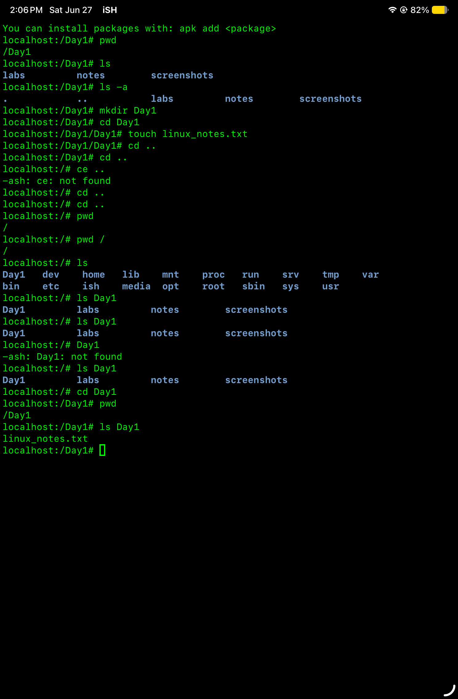

# Linux-Day-1

## Topics
Linux Filesystem and Navigation

## Objective

Learn the Linux filesystem and basic navigation commands.

## Why This Matters

Linux is the primary operating system used for embedded systems, semiconductor validation, automation, and firmware development.

## Commands learned

- `pwd` - shows the current working directory.
- `ls` - List files and directories.
- `mkdir` - Creates a new direcctory.
- `touch` - Create an empty file.

## Notes

Today I learned how linux organizes files and folders
I also learned how to navigate directories using Linux commands.

## Terminal Screenshot

## Mini Lab

Created the following structure:

Day1/

├── notes

├── screenshots

└── linux_notes.txt
